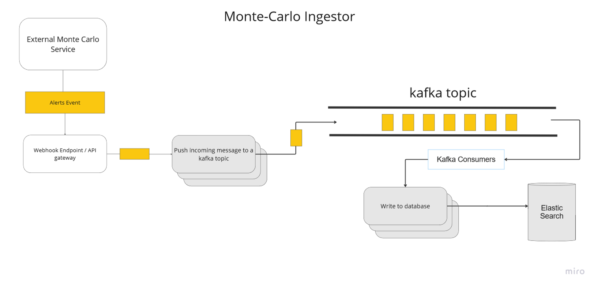

docker build command

`docker build -t notification-ingestor-lamda -f Dockerfile .`

### Setup K8s services
 prerequisite to install minikube - https://minikube.sigs.k8s.io/docs/start/
1. minikube start
2. add kafka helm chart
```
helm repo add bitnami https://charts.bitnami.com/bitnami
helm repo update
helm install kafka bitnami/kafka --set persistence.enabled=false
```
2. apply all k8s yaml files `find k8s -type f | xargs -n1 kubectl apply -f `


